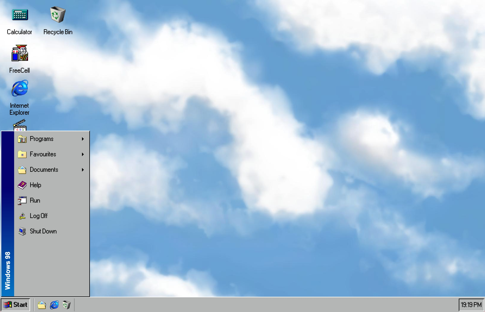
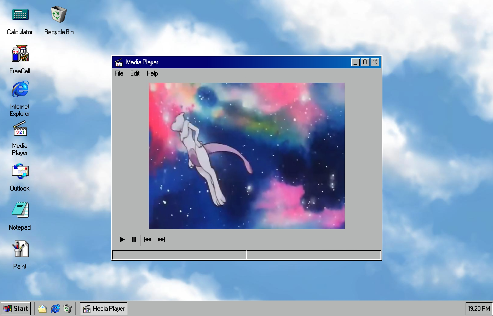
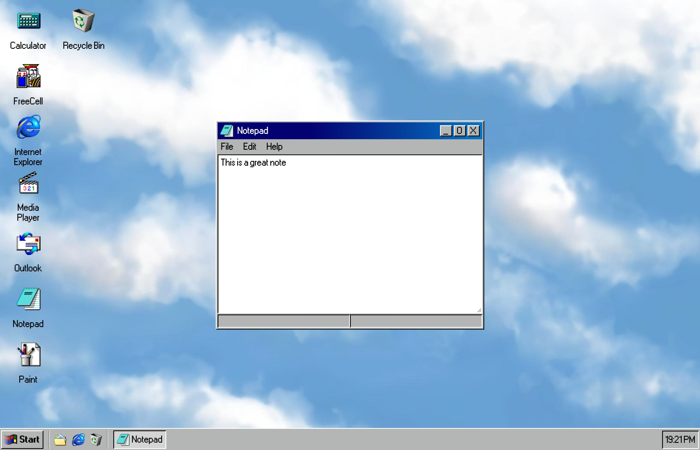
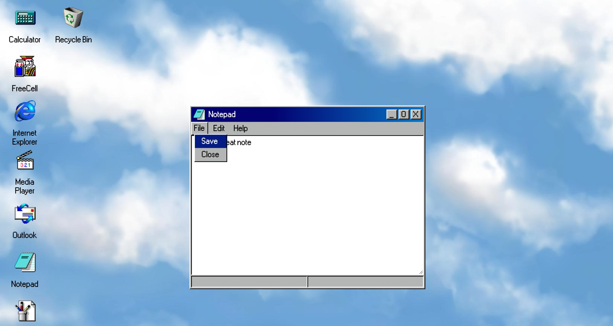
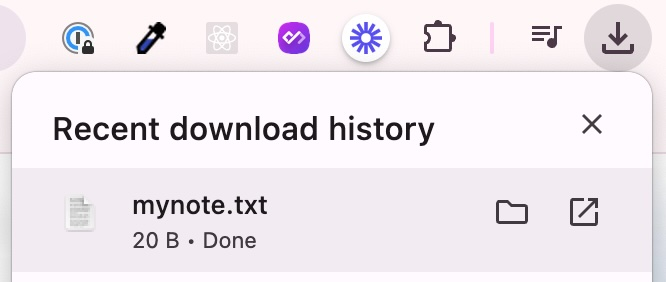
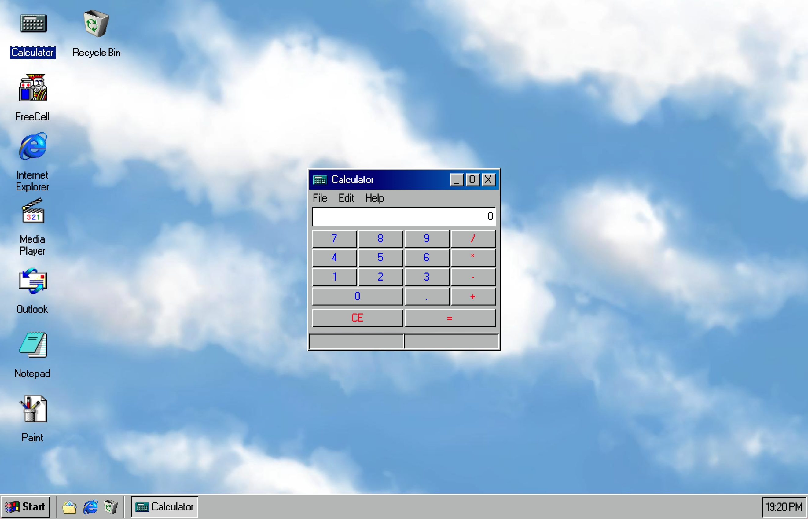

# Fake Windows 98 OS

Welcome to my fake OS project! This projects goal was to simulate the look and feel of an old school OS such as Windows 98, complete with various working applications. The project is built using HTML, CSS, and JavaScript.

## Table of Contents

-   [View the Live Site](https://windows-98-os.vercel.app/)
-   [Key Features](#key-features)
-   [Installation](#installation)

## Key Features

### Modals

Similar to any OS, each application in this project opens in a modal window. THe modals have been created using javascript and so are reuaable across all applications.

### Media Player

The project showcases a media player that plays and pauses videos, and allows the user to skip to the next video or go back to the previous video.



### Notepad

This project includes a notepad application which allows the user type anything they'd like into a free area text box. The user is also able to save their note vie the `file > save` menu, and this will prompt a download and save the text file to their local computer.





### Calculator

This project includes a fully functioning calculator, including the use of the standard four mathematical operations (`+, -, /, *`), support for decimals and the ability to clear the calculator.



### Menus

This project also incoludes the classic windows start menu and modal navigation menu's (e.g. 'File', 'Edit'). These are all functioning and able to be interacted with, including hover and active states where appropriate.

## Installation

1. Clone the repository using the following:

```bash
git clone https://github.com/kvtrice/windows-98-OS.git
```

2. Head into the project directory as below:

```bash
cd windows-98-OS
```

3. Open `index.html` in your browser
